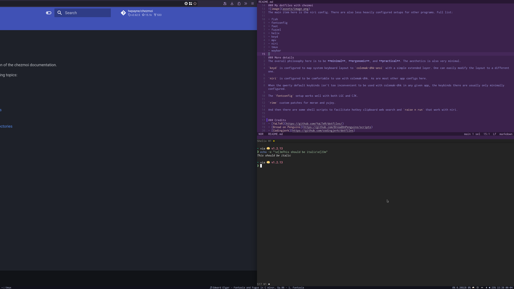

### My dotfiles with chezmoi
For your information, here is a screenshot:

The main item of interest here is the niri config and the shell scripts that go with it. There are also a few less configured setups for other programs. List:

- fish
- fontconfig
- foot
- fuzzel
- helix
- keyd
- mpv
- niri
- tmux
- waybar

### More details
The overall philosophy here is to be **minimal**, **ergonomic**, and **practical**. The aesthetics is also very minimal.

`keyd` is configured to map system keyboard layout to `colemak-dhk-ansi` with a simple extended layer. The layout can be esaily modified.

`niri` is configured to be comfortable to use with colemak-dhk. As are most other app configs here.

When the qwerty default keybinds isn't too inconvenient to be used with colemak-dhk in any given app, the keybinds there are usually untouched or only minimally configured.

The `fontconfig` setup works well with both LGC and CJK texts.

There are also custom `rime` patches for moran and yujoy.

And then there are some shell scripts to facilitate hotkey clipboard web search and `raise n run` that work with niri.

### Credits
- [YaLTeR](https://github.com/YaLTeR/dotfiles/)
- [Bread on Penguins](https://github.com/BreadOnPenguins/scripts)
- [Codingjerk](https://github.com/codingjerk/dotfiles)
